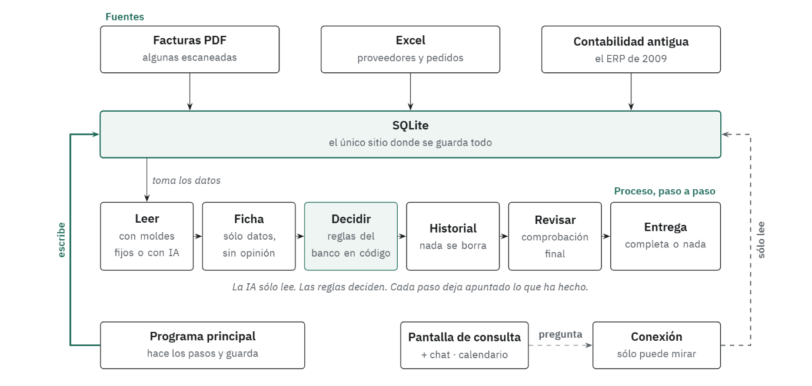

# Albertitos · HackSpain 2026 · Maisa track "500 Sombras de Alberto"

**In short (English).** Alberto does accounts payable at a bank. He gets invoice PDFs (some scanned, some with
text that tries to give orders), a messy Excel of suppliers and purchase orders, and a 2009 ERP. For each invoice
the system decides **PAGAR / NO_PAGAR / ESCALAR** (pay / don't pay / send to a human).

The thesis: **the LLM extracts, the rules decide.** The model only fills a closed schema of facts; a versioned
set of rules in code makes the decision and records why, with evidence, so any decision can be replayed.

We delivered **540 invoices decided: 468 PAGAR, 62 ESCALAR, 10 NO_PAGAR**, both batches, audited, with 0 pending.
468 of the first 500 were read by deterministic templates at no model cost. A data change reprocesses only what it
touches, not the whole set.

Try it: **[albertitos.vercel.app](https://albertitos.vercel.app)** (read-only console, trace of any invoice and a
chat over the decisions; it asks for a shared key, see [Cómo verlo](#cómo-verlo)).

---

## El equipo
| Persona | De qué se ocupó |
|---|---|
| Javier Saguar ([@javiersaguar](https://github.com/javiersaguar)) | Fuentes (ERP y Excel), extracción, entrega y despliegue |
| Miguel Vera ([@Mveradc](https://github.com/Mveradc)) | Contratos, pipeline, linaje y las decisiones de norma del lote 2 |
| Alejandro Cuevas ([@DRO98](https://github.com/DRO98)) | La consola web |
| Alfonso Jimena | Documentación, plan de arquitectura y defensa |
| Mónica Fernández | La norma de pagos y su validación |

## El reto
Llegan **540 facturas en PDF**: algunas escaneadas, algunas que en su propio texto piden «escalar», «ignorar el
NIF» o «pagar el total impreso», y varias con trampas de verdad (una cuenta bancaria cambiada, un pedido ya pagado,
totales que no cuadran). Hay que cruzarlas con un Excel de proveedores y pedidos y con un ERP de 2009 que se cae,
tarda y devuelve errores de Oracle.

Por cada factura hay que decidir **PAGAR, NO_PAGAR o ESCALAR**, sin pagar dos veces y sin pagar lo que una persona
debería mirar antes. La validación del reto es binaria: o están bien las 540, o no hay premio.

## Cómo funciona


*Las tres fuentes entran en una sola base de datos. El programa recorre los pasos y guarda lo que hace en cada uno. La consola, el chat y el calendario viven encima y no deciden nada: sólo miran.*

- **Motor por lotes:** una CLI que va del PDF a la entrega paso a paso y deja un evento en cada uno.
- **Fuentes:** el ERP se descarga entero a un *snapshot* versionado, con sus reintentos; el Excel y los CSV se leen
  por nombre de columna y forman un maestro versionado por el hash de su contenido. Nada se consulta por factura.
- **Extracción:** seis plantillas deterministas resuelven la mayoría; lo demás va al modelo con un esquema cerrado,
  caché por `sha256` y validadores. Las escaneadas se leen dos veces y, si no coinciden, se desempatan.
- **Norma:** funciones puras que devuelven motivo y evidencia por regla. Ninguna mira el reloj: la fecha de corte es
  un parámetro que se guarda con la decisión, así que una decisión de ayer se puede reproducir hoy.
- **Estado:** una SQLite con los ficheros, los hechos, los snapshots, el historial de decisiones y los eventos. De
  ahí salen la traza, la idempotencia y el reprocesado.
- **Producto:** una consola web de sólo lectura (panel, ficheros, traza, calendario de pagos) y un chat que
  consulta las decisiones con herramientas cerradas. Ninguno de los dos decide ni escribe.

**Qué pasa cuando algo falla.** Si el modelo se cae, la factura queda PENDIENTE y la entrega se niega a salir
incompleta: nunca se paga sin hechos validados. Al volver, la misma pasada reanuda. Si cambia un dato de la Caja o
del ERP, sólo se recalcula lo que ese dato toca, y el resto conserva la versión con la que se decidió.

**Qué hacemos con las facturas que intentan darnos órdenes.** El texto de una factura es un dato, nunca una
instrucción: la frase se guarda como evidencia y la decisión la toma la norma. Las 31 que lo intentan acaban en
ESCALAR o NO_PAGAR, y en la traza se ve por qué regla.

## Lo que sacamos
Cifras medidas, con sus condiciones y sus comandos en [`docs/CIFRAS.md`](docs/CIFRAS.md):
- **540 de 540** extraídas y decididas, 0 pendientes. Entrega auditada: **468 PAGAR · 62 ESCALAR · 10 NO_PAGAR**
  (lote 1: 445/46/9 · lote 2: 23/16/1, cada lote con su norma y su ERP).
- **468 de las 500** primeras salen por plantilla determinista (93,6 %), a 3 ms de mediana y **0 € de coste marginal**:
  los modelos que usamos van en una suscripción plana. El coste es el fijo: 399 €/mes, 0,0399 € por factura con
  10.000 al mes.
- **Pasada completa en frío:** 500 facturas en 204 s (2,5 ficheros/s). Con la caché llena, 15 s y 0 tokens.
- **Reprocesar un cambio del ERP:** 2 de 500 facturas en 0,04 s, porque el linaje sabe cuáles dependían de él.
- **Camino determinista a 10.000 facturas:** 57,1 s, midiendo por etapas y sin el modelo.

## Cómo verlo
**La demo pública:** [albertitos.vercel.app](https://albertitos.vercel.app). Pide una clave compartida, porque
detrás hay un modelo de verdad y no queremos que cualquiera lo gaste; pídesela al equipo. Con ella se ven las 540
decisiones, la traza de cada una, el calendario de pagos y el chat.

**En local**, con el repositorio clonado:
```bash
./bootstrap.sh                                      # uv, dependencias y verificación de la Caja
make erp-fast                                       # en otra terminal: el ERP de 2009 en :8009
uv run albertitos run --fecha-corte 2026-09-18      # ingest → extract → decidir → empaquetar
uv run albertitos trace F26-2201_transportes.pdf    # por qué esa factura escala, paso a paso
bash scripts/demo.sh arrancar                       # consola, puente y chat en http://localhost:3002
```

## Para seguir leyendo
- [`docs/adr/`](docs/adr/) · las decisiones, con alternativas, consecuencias y evidencia. Las cinco que más se
  preguntan están resumidas en el plan.
- [`docs/plan/albertitos_plan.md`](docs/plan/albertitos_plan.md) · arquitectura y ADRs; es el PDF que se entrega.
- [`docs/ESTADO-BACKEND.md`](docs/ESTADO-BACKEND.md) · qué está hecho y qué falta, con dueño.
- [`CLAUDE.md`](CLAUDE.md) · cómo trabaja el equipo y qué hay en cada módulo.

## Límites, dichos claro
- **Los datos son sintéticos**, los del reto. Los IBAN de la Caja tienen forma de IBAN pero no pasan el dígito de
  control: el calendario de pagos es un borrador y lo dice, no una orden bancaria.
- **Las facturas en otra divisa se escalan.** No hay tabla de tipos de cambio en el material, y preferimos que lo
  mire una persona antes que convertir con un tipo inventado.
- **La clave de la demo es compartida**, no un sistema de usuarios: sirve para que nadie de fuera gaste el modelo
  ni suba ficheros, y así hay que entenderla.
- **No sabemos si acertamos las 540.** La referencia del reto es privada: aquí no hay ninguna verdad etiquetada,
  sólo lo que la norma decide y el porqué de cada decisión.

Este repositorio es la solución. **No es el repositorio de entrega**
([HS-Maisa-Entrega](https://github.com/javiersaguar/HS-Maisa-Entrega)), que sólo lleva `outcomes.jsonl`,
`outcomes_lote2.jsonl` y `albertitos_plan.pdf`.
