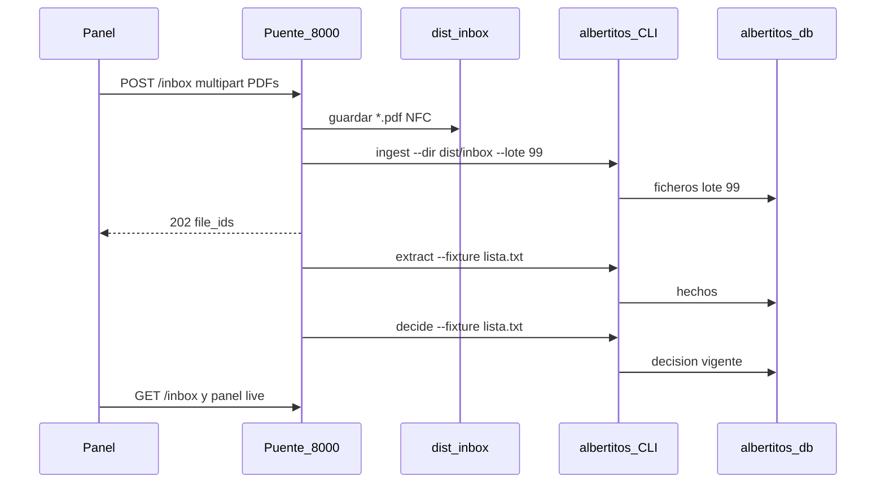

> **Implementado con cambios (PR #5, sáb 19).** La bandeja NO escribe en `dist/albertitos.db`: un lote 99 allí deja la auditoría en ROJO (`comprobar_fantasmas`) y el siguiente `run` lo mete en `marcar_duplicados`. Va sobre `dist/bandeja.db` con `api --bandeja` (409 contra la BD de la entrega). La UI es una zona fija arriba a la derecha del panel, no botón + modal. Lo vigente está en `src/albertitos/console/CLAUDE.md` y `console/bandeja.py`; lo de abajo es el plan original.

# Añadir facturas desde el panel

La consola sigue sin importar `extract/` ni `rules/` (el test AST de [`tests/test_console.py`](tests/test_console.py) lo vigila). La única escritura es el mismo patrón que ya admite [ADR-0007](docs/adr/0007-formato-cli-consola-y-traza-en-la-entrega.md): el puente guarda los PDF y llama a la CLI como subproceso.

**No se usa lote 1 ni 2.** Un PDF extra en esos lotes rompe `package` (conjunto exacto) y `marcar_duplicados` ya marcó originales de la Caja cuando metimos un lote 2 simulado. La bandeja va a **lote 99**. `package` solo emite lotes 1 y 2, así que la entrega no se toca.



## 1. Un flag en la CLI (cambio mínimo, avisar a Miguel)

[`etapas.decide`](src/albertitos/pipeline/etapas.py) ya acepta `solo=`. [`extract`](src/albertitos/cli.py) ya tiene `--fixture`. Añadir el mismo `--fixture` a `decide` para no redecidir las 500 ni llamar a `reprocess --impacted` (ese sí corre `marcar_duplicados` sobre toda la BD).

```text
albertitos ingest --dir dist/inbox --lote 99
albertitos extract --fixture dist/inbox/lista.txt
albertitos decide --fixture dist/inbox/lista.txt
```

`decide` sigue exigiendo `ALBERTITOS_FECHA_CORTE` (nunca `date.today()`). El subproceso hereda el `.env`.

## 2. Puente: `POST /inbox` + `GET /inbox`

Hoy [`despachar`](src/albertitos/console/api.py) responde 405 a todo POST. Excepción única: `/inbox`. El resto de POST sigue en 405. CORS: añadir `POST`.

Comportamiento:

- Multipart, varios `.pdf`, nombres en NFC. Tope razonable (p. ej. 20 ficheros, 10 MB). Sin dependencias nuevas (parser stdlib).
- Destino: `dist/inbox/` (ya cubierto por `dist/` en `.gitignore`).
- Ingest **síncrono** (rápido) y respuesta **202** con `{ file_ids, lote: 99 }`.
- En un hilo de fondo: `extract --fixture` + `decide --fixture`. Un job a la vez; el segundo POST responde 409.
- `GET /inbox`: `{ estado: idle|ingiriendo|extrayendo|decidiendo|listo|error, file_ids, log, error }`.
- El puente **no** abre la BD en escritura: solo subprocess, igual que el botón de Streamlit.

Copias exactas de un PDF de la Caja: `ingest` las registra en `identidades` y no pisa el original (P0-1). El JSON puede decirlo si el CLI lo deja en el log.

## 3. UI en el panel

En [`console-web/app/page.tsx`](console-web/app/page.tsx), junto a «Exportar CSV» (prop `actions` de [`PipelineCard`](console-web/components/dashboard/PipelineCard.tsx)): botón **Añadir facturas**.

Modal/dropzone de **varios PDF** (el caso por defecto; uno también vale):

- Elegir o soltar ficheros → `FormData` con `apiFetch` (ya soporta `FormData` en [`lib/api/client.ts`](console-web/lib/api/client.ts)).
- Tras el 202, poll de `GET /inbox` cada ~1 s. El panel ya va en live: los ficheros salen como `PENDIENTE` y luego con PAGAR / NO_PAGAR / ESCALAR.
- Al terminar: toast + enlaces al detalle (`ficheroHref`) y a `/invoices?lote=99`.
- Si el LLM deja alguno `PENDIENTE`: mensaje claro, sin inventar decisión.
- Con mock (`NEXT_PUBLIC_USE_MOCK=true`): el botón no llama al puente; toast de que hace falta la API real.

Filtro de lote en [`FilterBar.tsx`](console-web/components/invoices/FilterBar.tsx): opción **Lote 99 · Bandeja**. [`loteNombre`](console-web/lib/format.ts) ya cae en `el lote 99`; se puede etiquetar «la bandeja».

No hace falta tocar `/runs/new` (sigue siendo la pantalla congelada). El flujo vive en el panel.

## 4. Tests y contrato

- [`tests/test_console.py`](tests/test_console.py): POST `/panel` sigue 405; POST `/inbox` sin PDF → 400; POST `/inbox` con un PDF de fixture → 202 y `lote=99` (el runner de extract/decide se stubbea: no LLM en `make check`).
- El test AST `test_console_no_importa_rules_ni_extract` no se toca.
- No subir `API_CONTRACT_VERSION`: ruta nueva, los GET no cambian.
- Actualizar el contrato en [`src/albertitos/console/CLAUDE.md`](src/albertitos/console/CLAUDE.md).

## Riesgos que el diseño evita

- **Entrega:** lote 99 fuera de `package`.
- **Duplicados de la Caja:** no se llama `reprocess` / `marcar_duplicados`.
- **Consola que decide:** cero imports de norma; solo CLI.
- **Defensa sin red:** extract de un PDF nuevo puede ir al LLM; un PDF digital cubierto por plantilla o uno de la Caja (caché) no cobra. Si el LLM cae, el fichero queda PENDIENTE y se ve en el panel.
